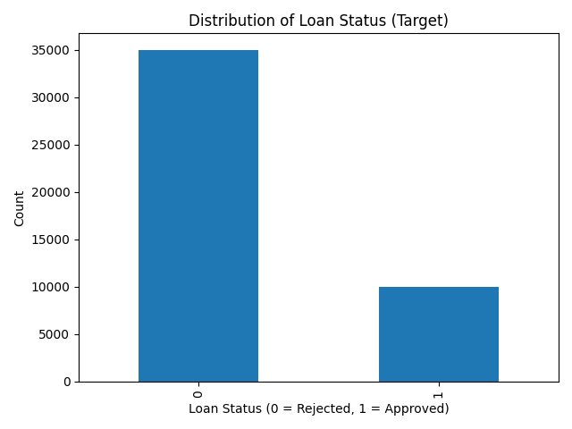
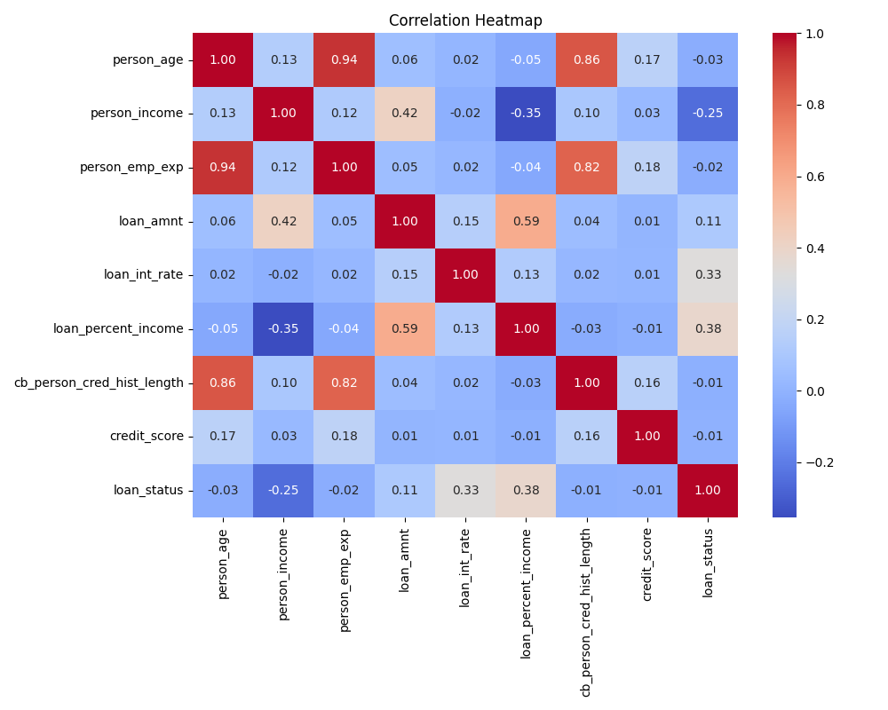
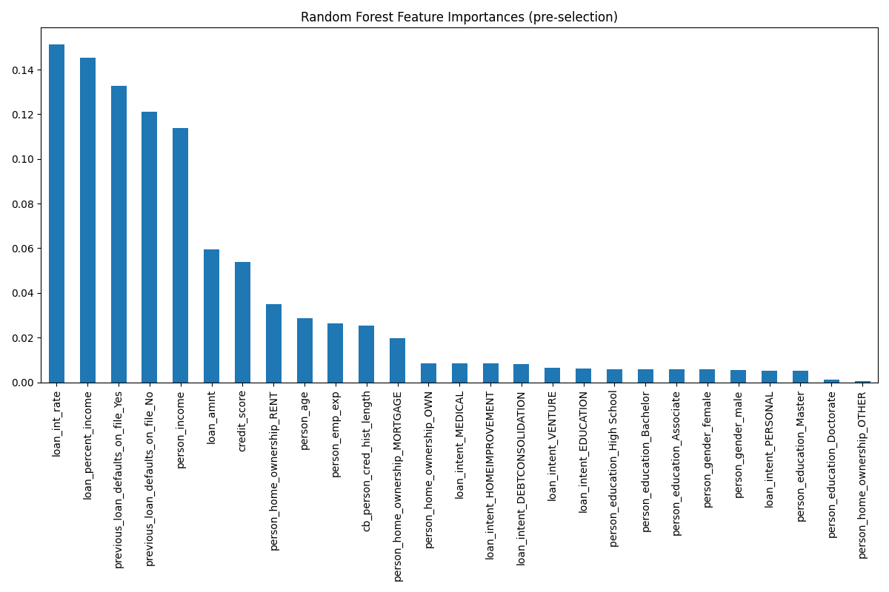
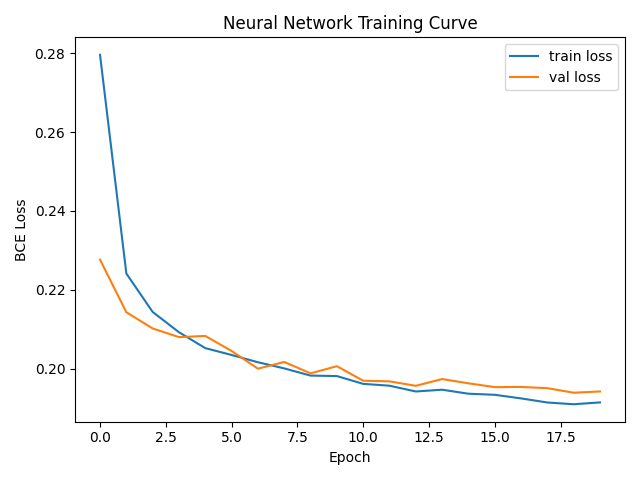

# Loan Approval Prediction

A machine learning project that predicts whether a bank loan application should be
**approved** or **rejected**, based on applicant demographics, income, employment history,
and credit profile. Built as a university mini-project (Université M'hamed Bougara -
Boumerdès, Computer Science).

## Problem

Banks need to evaluate large volumes of loan applications quickly while minimizing default
risk. This project frames loan approval as a **binary classification** task and compares
three models — Logistic Regression, Random Forest, and a PyTorch Neural Network — to find
the most effective approach.

## Dataset

- Source: [Loan Approval Classification Data (Kaggle)](https://www.kaggle.com/datasets/taweilo/loan-approval-classification-data)
- 45,000 loan applications, 14 columns, no missing values
- Target: `loan_status` (1 = approved, 0 = rejected)

| Feature | Description |
|---|---|
| `person_age` | Age of the applicant |
| `person_gender` | Gender of the applicant |
| `person_education` | Highest education level |
| `person_income` | Annual income |
| `person_emp_exp` | Years of employment experience |
| `person_home_ownership` | Home ownership status |
| `loan_amnt` | Requested loan amount |
| `loan_intent` | Purpose of the loan |
| `loan_int_rate` | Interest rate |
| `loan_percent_income` | Loan amount as % of income |
| `cb_person_cred_hist_length` | Length of credit history |
| `credit_score` | Applicant's credit score |
| `previous_loan_defaults_on_file` | Whether the applicant defaulted before |
| `loan_status` | **Target** — approved (1) / rejected (0) |

## Pipeline

1. **EDA** — distributions, class balance, outlier detection (histograms, boxplots, correlation heatmap)
2. **Preprocessing** — IQR-based outlier capping, median/mode imputation, one-hot encoding, standard scaling
3. **Feature selection** — drop features with Random Forest Gini importance < 0.01
4. **Split** — 60% train / 20% validation / 20% test, stratified; 5-fold CV used during model selection
5. **Models** — Logistic Regression (baseline), Random Forest, PyTorch feedforward Neural Network
6. **Evaluation** — Accuracy, Precision, Recall, F1, ROC-AUC

## Results

Measured on the held-out test set (20% of the data), from an actual run of
`notebooks/loan_approval_analysis.ipynb`:

| Model | Accuracy | Precision | Recall | F1 | ROC-AUC |
|---|---|---|---|---|---|
| Logistic Regression | 0.8980 | 0.7812 | 0.7515 | 0.7661 | 0.9527 |
| Random Forest | 0.9211 | 0.8686 | 0.7600 | 0.8107 | 0.9690 |
| Neural Network | 0.9153 | 0.8505 | 0.7510 | 0.7977 | 0.9656 |
| **XGBoost** | **0.9257** | 0.8687 | **0.7840** | **0.8242** | **0.9734** |

**XGBoost** edges out Random Forest on every metric, confirming the comparison originally
discussed only hypothetically in the project report — it's now a real trained model in the
notebook, not an estimate. Random Forest remains a close second and is a reasonable choice
when training time or interpretability tooling matters more than the last percentage point
of performance.

The most predictive features across the tree-based models were consistently
`loan_percent_income`, `loan_int_rate`, `previous_loan_defaults_on_file`, and
`person_income` — all standard credit-risk indicators, which is a good sanity check that the
models are learning sensible relationships rather than spurious ones.

*Exact numbers will vary slightly run-to-run depending on library versions; re-run the
notebook to reproduce or update this table.*






## Repository Structure

```
.
├── README.md
├── requirements.txt
├── data/                          
├── notebooks/
│   └── loan_approval_analysis.ipynb
├── report/
│   └── loan_approval_report.pdf
├── results/                       # generated plots and metrics (created on run)
└── models/                        # saved trained models (created on run)
```

## Getting Started

1. Clone the repo and install dependencies:
   ```bash
   pip install -r requirements.txt
   ```
2. Download the dataset from Kaggle and place it at `data/loan_data.csv`.
3. Run the notebook:
   ```bash
   jupyter notebook notebooks/loan_approval_analysis.ipynb
   ```

Trained models and evaluation plots are saved to `models/` and `results/`.

## Future Work

- Address class imbalance more explicitly (resampling / class weights / threshold tuning)
- Add SHAP-based explainability for regulatory transparency
- Hyperparameter tuning (grid/random search or Optuna) for all four models
- Deploy the best model (currently XGBoost) behind a simple API for real-time scoring

## Authors

Bengriche Abdellah, Benterkia Ilyes, Guettache Akram, Bellahcene Malik
